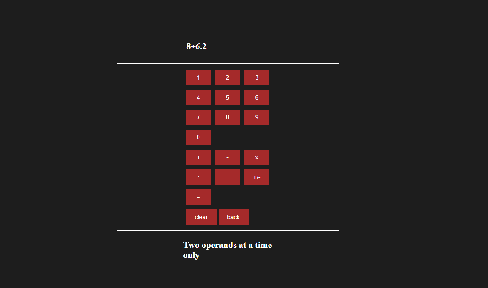

# Implementation of Basic Calculator using JAVSCRIPT, HTML, CSS

## Features:
- Basic operations viz. Addition, Subtraction, Multiplication and Division are implemented.
- The program supports decimal numbers.
- The program supports negative numbers as in the first operand can be given a negative number.
- The clear button clear the display.
- The back button can delete the latest character keyed in.

### Here is the snapshot of the calculator:

## Design:
- At present the program supports only 2 operands at a time.
- Some states are maintained based on the values keyed in. For input string the states are ["init", "op1", "final" ]
    - init is the initial state.
    - op1 is when the first operand is entered forllowed by a operator.
    - final is when the second operand is enters followed by "="

- The decimal numbers are calculated separating using parseFloat. So the program keeps track of decimal operands keyed in ["nodec", "dec1", "dec2", "dec12"]
  - nodec indicates there are no decimal numbers entered.
  - dec1 indicates that the first operand entered is a decimal numbers .
  - dec2 indicates that the second operand entered is a decimal numbers .
  - dec12 indicates that both the first and second operands entered are decimal numbers .
- Some more error handling is yet to be done.

